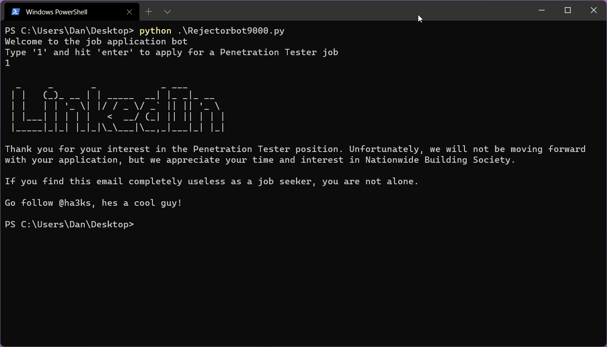

# Rejectorbot9000
 LinkedIn Rejections, in an instant!

Have you ever applied for a job on LinkedIn?

Have you had to wait days and days, only to receive an automated rejection email?

Well...

Now you and your loved ones can experience the crippling and pointless annoyance of rejection in an instant!

Using random and the small bit pf Python I remember now you can be automatically be rejected by a random company that uses these LinkedIn rejections hand curated from my own mailbox.

Enjoy!

Todo:
- ~~Edit to allow any text entry.~~
- limit employer output to one entry only (currently outputs one employer per char from input).
- relearn Python so you can be a functioning human again.